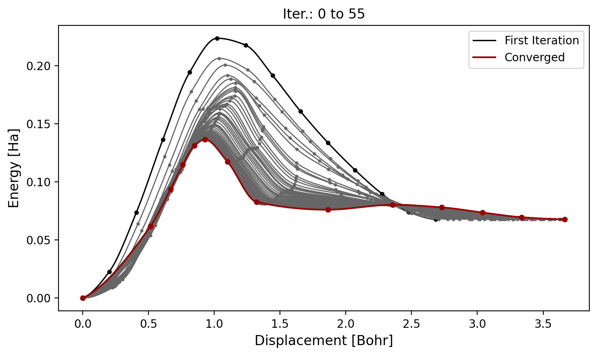

# VisNEB

VisNEB is a tiny toolkit to visualize **ORCA NEB** calculations from **multi-XYZ** files. It reads frames (images) with energies encoded in the XYZ **comment line** as `E <value>` and plots NEB energy profiles in a clean, legacy-style look.

## What it plots
- **X-axis — Displacement [Bohr]:** cumulative displacement along each path, computed as the **frame-to-frame RMSD** of atomic coordinates. By default coordinates are assumed in Å and converted to Bohr.
- **Y-axis — Relative energy [Ha]:** each path is shifted so its minimum energy is 0 (facilitates comparing paths).
- **Style:** first path **black**, intermediates **gray**, last path **red**. Original image points are shown, and a smooth curve passes through them.

## Hermite (PCHIP-like) smoothing
VisNEB draws a **cubic Hermite** curve between images using data-driven node slopes so the curve is **shape-preserving** (no spurious oscillations):
- Let the interval secants be \( \delta_i = (y_{i+1}-y_i)/(x_{i+1}-x_i) \).  
- At local extrema or sign changes (\( \delta_{i-1}\,\delta_i \le 0 \)), set \( m_i = 0 \) to avoid wiggles.
- Otherwise choose \( m_i \) as a **weighted harmonic mean** of \( \delta_{i-1},\delta_i \); endpoints are clipped (\( |m| \le 3|\delta| \)).  
These are the classical **PCHIP** conditions; they keep the interpolant monotone where the data are monotone and prevent overshoot.

## Input
- Multi-XYZ with repeated blocks: number of atoms, comment line (may contain `E <value>`), then atom coordinates.  
- Frames in a path must have identical atom order and count.

## Quick use
```bash
# Path(s) from a multi-XYZ file
python visneb.py path  --xyz path_with_E.xyz
python visneb.py paths --xyz many_paths.xyz --nodes-per-path 14

# Save instead of show
python visneb.py paths --xyz many_paths.xyz --nodes-per-path 14 --save plots/neb.png
```

## Example output
Running with the added example `./test/test.xyz`
```bash
python visneb.py paths --xyz ./test/test.xyz --nodes-per-path 14 --dpi 200 --save ./fig/example.png
```
Given an output of the figure:

